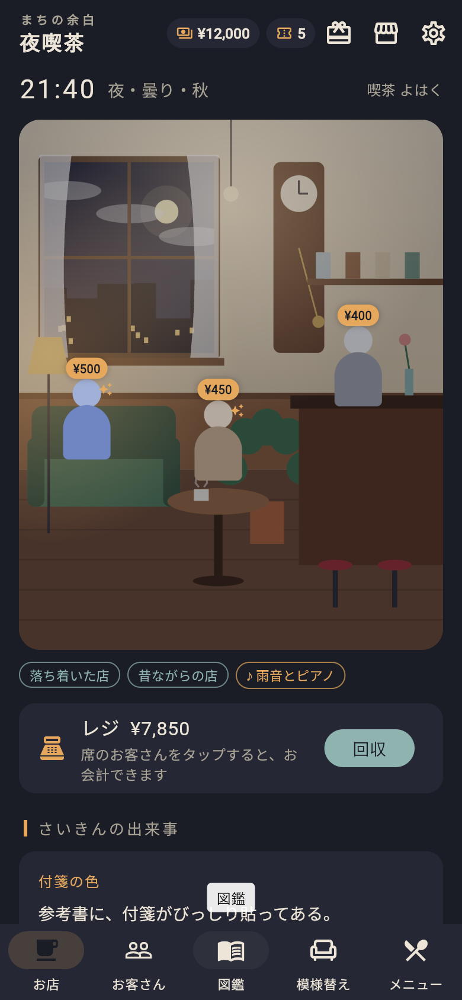
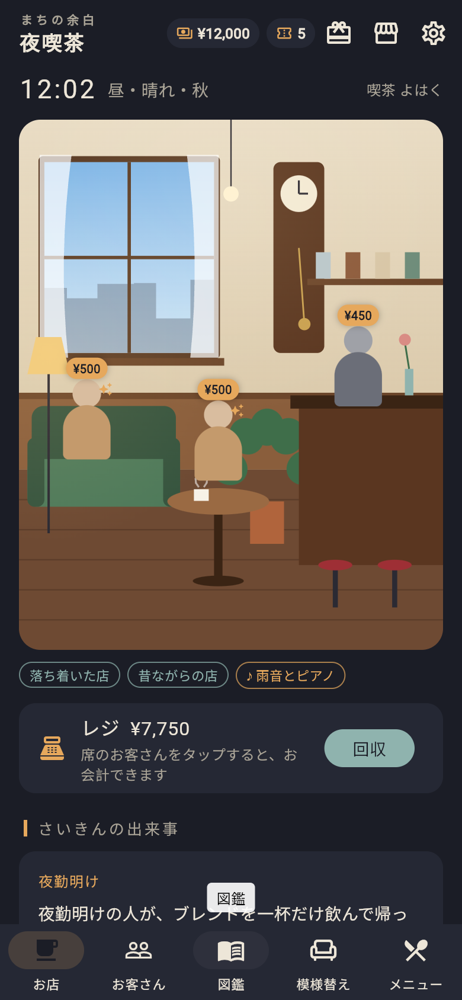
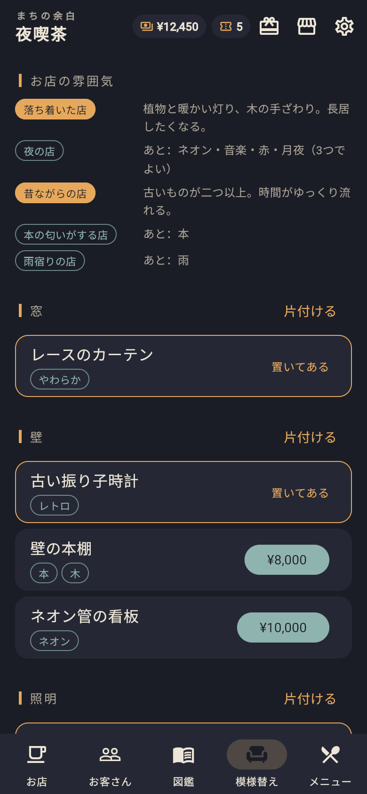

# まちの余白：夜喫茶（モック）

「まちの余白」シリーズ第 1 作『夜喫茶』のモックです（Flutter、スマホ向け）。
住宅街の端の小さな喫茶店を、アプリを閉じている間も営業させておき、
ときどき覗いて、客と小さな出来事を集めるゲームです。

| おかえりなさい | 夜の店 | 昼の店 | 客詳細 |
| --- | --- | --- | --- |
|  |  |  |  |

| 模様替え（雰囲気） | 図鑑 | 余白くじ（排出率・天井） | ショップ |
| --- | --- | --- | --- |
|  |  |  |  |

## 動かす

```bash
flutter pub get
flutter run            # 実機・シミュレータ
flutter run -d chrome  # ブラウザで確認
flutter test           # 放置計算・天井・雰囲気などのテスト
```

待たずに試すには **設定 → 試遊用（デバッグ）** の「+8 時間」などで時間を進めてください。

## 中身

- 規模は企画書の「最初の試作品」: 客 5 人・家具 10 個・メニュー 5 個・出来事 5 つ・放置上限 12 時間
  （＋有料エピソード 1 本、くじ・セット販売のアイテム）
- 画面 10 枚：ホーム／放置結果／客一覧／客詳細／図鑑／家具／メニュー／余白くじ／ショップ／設定
- 画像素材なし。店は背景・家具・天気・照明を `CustomPainter` のレイヤーで描画
- 課金はモック（決済は発生しません）
- ローカル保存（shared_preferences）。本実装では Drift + Supabase へ移行予定

仕様の詳細は [docs/SPEC.md](docs/SPEC.md) を参照してください。

## 構成

```text
lib/core/            シリーズ共通のエンジン（放置・天気・雰囲気・出来事・くじ・セーブ）
lib/titles/yoru_kissa/  夜喫茶のコンテンツ定義と店の描画
lib/features/        10 画面
test/                エンジンのテスト
```

第 2 作（古本屋・銭湯・海辺…）は `lib/titles/` にコンテンツを追加し、
`contentProvider` を差し替えて作る想定です。
