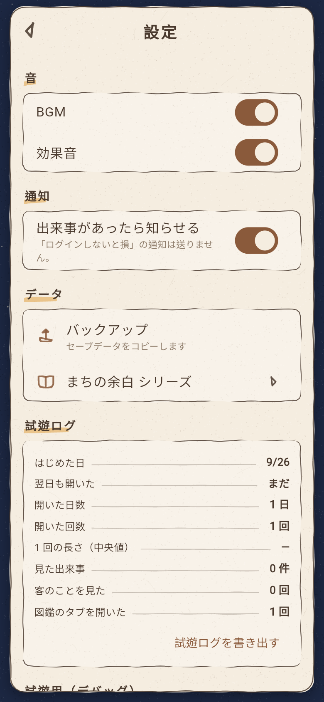

# まちの余白：夜喫茶（モック）

「まちの余白」シリーズ第 1 作『夜喫茶』のモックです（Flutter、スマホ向け）。
住宅街の端の小さな喫茶店を、アプリを閉じている間も営業させておき、
ときどき覗いて、客と小さな出来事を集めるゲームです。

| タイトル | お店（ホーム） | おかえりなさい | 特別な出来事 |
| --- | --- | --- | --- |
|  |  |  |  |

| 来店客一覧 | 客詳細 | 客の出来事 | 図鑑 |
| --- | --- | --- | --- |
|  |  |  |  |

| 家具 | メニュー | 余白くじ | ショップ |
| --- | --- | --- | --- |
|  |  |  |  |

| 雨の日 | 雪の日 | 設定 | 試遊ログ |
| --- | --- | --- | --- |
|  |  |  |  |

## 動かす

```bash
flutter pub get
flutter run            # 実機・シミュレータ
flutter run -d chrome  # ブラウザで確認
flutter test           # 放置計算・保存・課金・通知などのテスト

# DB の表を変えた時だけ
dart run build_runner build --delete-conflicting-outputs
```

待たずに試すには **設定 → 試遊用（デバッグ）** の「+8 時間」などで時間を進めてください。

## 中身

- 規模は企画書の「最初の試作品」: 客 5 人・家具 10 個・メニュー 6 個・出来事 5 つ・放置上限 12 時間
  （＋有料エピソード 1 本、くじ・セット販売のアイテム）
- 画面 10 枚＋タイトル・特別な出来事・シリーズ一覧。お店を基点に、下のしるしから紙のパネルを開く
- 絵はコードで描いた仮の絵（輪郭は手描きの揺れた線、紙の粒）。アイコンは判子風の一文字。
  **決まった場所に PNG を置けば、その部分だけ本番の絵に差し替わる**（[docs/ART_GUIDE.md](docs/ART_GUIDE.md)）
- 保存は端末の SQLite（Drift）。クラウドのバックアップと機種変更は Supabase（[supabase/README.md](supabase/README.md)）
- 課金（in_app_purchase）・広告（AdMob）・通知（出来事の時だけ）・BGM と効果音（仮の音）・試遊ログ
- 何も指定せずにビルドすると試作版（決済・広告はテスト用、クラウド無し）。
  本番の設定は [docs/STORE_SETUP.md](docs/STORE_SETUP.md)

仕様の詳細は [docs/SPEC.md](docs/SPEC.md) を参照してください。

## 構成

```text
lib/core/            シリーズ共通（放置・天気・雰囲気・出来事・くじ・保存・課金・広告・通知・音・絵の差し替え）
lib/titles/yoru_kissa/  夜喫茶のコンテンツ定義と店の描画
lib/features/        10 画面
test/                テスト（放置計算・保存・通知・課金・音・絵・試遊ログ・クラウド）
assets/audio/        仮の BGM・効果音（tools/make_placeholder_audio.py で生成）
assets/art/          本番イラストの置き場所（空なら仮の絵）
supabase/            サーバーの表・関数・検証用 SQL
```

第 2 作（古本屋・銭湯・海辺…）は `lib/titles/` にコンテンツを追加し、
`contentProvider` を差し替えて作る想定です。
